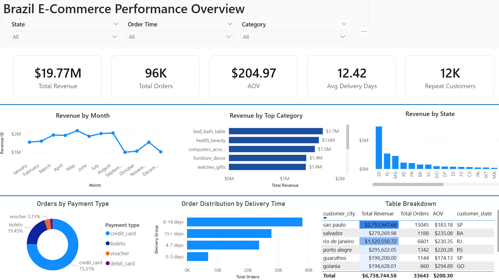

# 🛒 Brazil E-Commerce Performance Analysis

## 📌 Project Overview
Analyzed 100,000+ orders from Brazil's largest e-commerce platform (Olist) to uncover revenue trends, customer behavior, and delivery performance using **SQL Server** and **Power BI**.

---

## 🛠️ Tools & Technologies
- **SQL Server** — Data exploration, cleaning, and analysis
- **Power BI** — Interactive dashboard and visualization

---

## 📂 Dataset
- **Source:** [Olist Brazilian E-Commerce Dataset – Kaggle](https://www.kaggle.com/datasets/olistbr/brazilian-ecommerce)
- **Size:** 7 relational tables, 99,441 orders
- **Period:** September 2016 – October 2018

| Table | Rows |
|-------|------|
| customers | 99,441 |
| orders | 99,441 |
| order_items | 112,650 |
| order_payments | 103,886 |
| products | 32,951 |
| sellers | 3,095 |
| geolocation | 1,000,163 |

---

## 🔍 SQL Analysis Process

### 1. Data Exploration
- Verified row counts across all 7 tables
- Inspected column data types and NULL values
- Confirmed date range: 25 months of transaction data

### 2. Business Analysis
- Order status distribution and cancellation rate
- Monthly revenue and order volume trends
- Regional sales breakdown by customer state
- Product category performance ranking
- Payment type analysis
- Delivery time calculation

### 3. Data Modeling
Created a consolidated `sales_master` VIEW by joining 7 tables — used as the single data source for the Power BI dashboard.

```sql
CREATE VIEW dbo.sales_master AS
SELECT
    o.order_id,
    o.customer_id,
    o.order_purchase_timestamp,
    o.order_delivered_customer_date,
    c.customer_state,
    c.customer_city,
    p.payment_value,
    p.payment_type,
    oi.price,
    oi.freight_value,
    t.product_category_name_english
FROM dbo.olist_orders_dataset o
JOIN dbo.olist_customers_dataset c ON o.customer_id = c.customer_id
JOIN dbo.olist_order_payments_dataset p ON o.order_id = p.order_id
JOIN dbo.olist_order_items_dataset oi ON o.order_id = oi.order_id
JOIN dbo.olist_products_dataset pr ON oi.product_id = pr.product_id
LEFT JOIN dbo.product_category_name_translation t ON pr.product_category_name = t.product_category_name
WHERE o.order_status = 'delivered';
```

---

## 📊 Power BI Dashboard



**Features:**
- KPI cards: Total Revenue, Total Orders, AOV, Avg Delivery Days, Repeat Customers
- Revenue trend by month (line chart)
- Top categories by revenue (bar chart)
- Revenue by state (map/bar chart)
- Payment type breakdown (donut chart)
- Order distribution by delivery time
- City-level table breakdown

---

## 💡 Key Findings

- **97% delivery success rate** — 96,478 out of 99,441 orders successfully delivered
- **São Paulo dominates** — SP accounts for 40,500 orders and $5.77M in revenue, far ahead of all other states
- **Health & Beauty is the #1 category** — $1.26M in product sales, followed by Watches & Gifts ($1.2M)
- **Average delivery time is 12 days** — majority of orders fall in the 8–14 day range, indicating a potential logistics bottleneck
- **Strong growth trend** — monthly orders grew from 324 (Oct 2016) to 7,000+ by early 2018
- **Credit card dominates payments** — used in 75% of all transactions

---

## 📁 Repository Structure

```
Brazil-Ecommerce-Analysis/
├── README.md
├── sql/
│   └── analysis.sql
└── dashboard/
    └── dashboard.png
```

---

## 👤 Author
**[Your Name]**  
McMaster University — B.Sc. Mathematics & Statistics  
www.linkedin.com/in/sungjinpark25 | https://github.com/sungjinpark25
